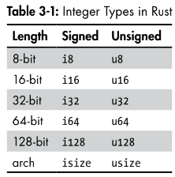

# Data Types Notepad

## Notes

- Different Type annotations so Far:
- Scalar Types, Integer Types 
- isize and usize are determined by the architecture of the computer for me that would be 64
- Note 3

## Scalar

- Single value
- 4 Scalar Types: integers, floating-point numbers, Booleans and Characters
- 

## Integer Types

- if integer starts with i it is signed
- 
- 
- Idea 3